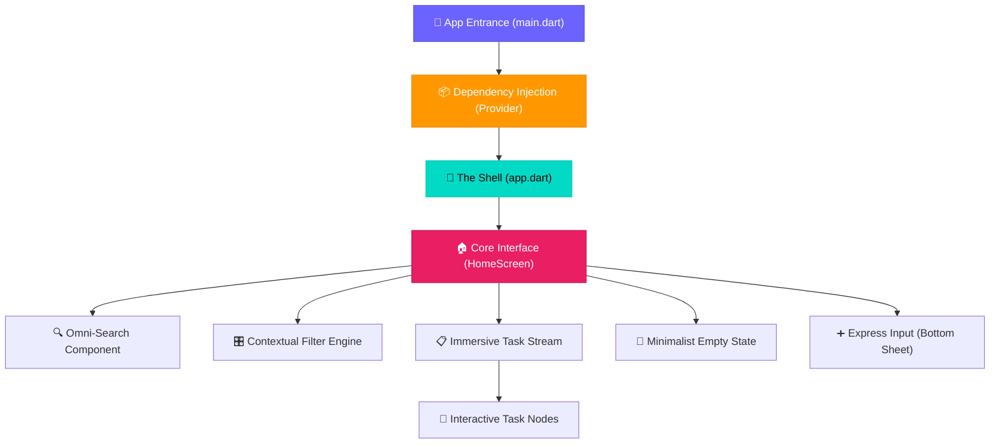
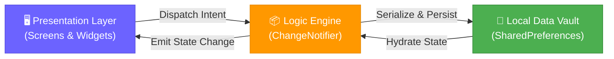
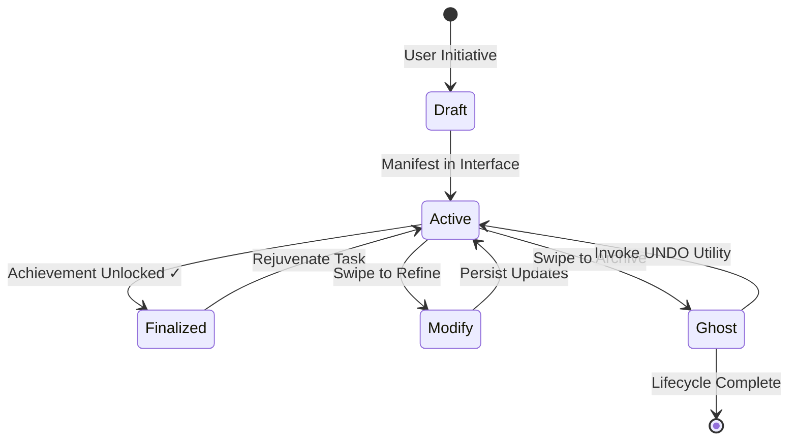

<


###  "Where Simplicity Meets Sophistication."

**Flutter Todo** is a masterclass in modern mobile design. What began as a primitive [Python script](App.py) has been meticulously re‑engineered into a premium, immersive task management experience that lives at the intersection of beauty and utility.

---


---

</div>

---

## 💎 Crafted for Excellence

Experience a task manager that feels like an extension of your intent. Every interaction is fluid, every transition is intentional.

| Core Capability | The Experience |
|:----------------|:---------------|
| ⚡ **Fluid CRUD** | Effortlessly draft, refine, or archive tasks with zero friction. |
| 🏷️ **Smart Categorization** | Organize your world into six curated domains: Personal, Work, Shopping, Health, Education, or Other. |
| 🎨 **Dynamic Prioritization** | Visual indicators (High/Med/Low) that adapt to your focus with sophisticated color theory. |
| 🔍 **Instant Search** | A high-performance search engine that finds your thoughts before you finish typing. |
| 🎛️ **Granular Control** | Advanced filtering and sorting mechanisms to isolate what truly matters at any moment. |
| 🌗 **Total Immersion** | A state‑of‑the‑art Dark/Light engine that respects your environment and persists your choice. |
| 👆 **Gestural Navigation** | Use intuitive swipe patterns to manipulate state—edit or delete with elegant, tactile feedback. |
| ↩️ **Safety First** | An intelligent undo system that gives you a window of grace after every deletion. |
| 💾 **Robust Persistence** | Your data stays with you. Local storage architecture ensures your roadmap is always available, offline or online. |

---

## 🏗️ Architectural Elegance

The system is built on a "Clean Architecture" foundation, ensuring scalability, testability, and a seamless developer experience.



---

## 🔄 The Data Engine

A unidirectional data flow meticulously manages state changes, reflecting updates instantly across the entire surface of the app.



---

## 🗺️ State Lifecycle



---

## 📂 Structural Intelligence

A folder structure designed for the next generation of feature sets.

```text
Simple_to-do_Lisy/
├── App.py                          # 🐍 Legacy CLI Engine
├── README.md                       # 📖 Product Manual
├── screenshots/                    # 🖼️ Brand Visuals
└── flutter_todo/                   # 📱 Rebuilt Flutter Implementation
    ├── lib/
    │   ├── models/                 #    Immutable Data Structures
    │   ├── providers/              #    Central State Authority
    │   ├── services/               #    Infrastructure & Persistence
    │   ├── screens/                #    User Surface Components
    │   ├── widgets/                #    Reusable UI Building Blocks
    │   └── theme/                  #    Design System & Visual Tokens
    └── test/                       #    Automated Quality Assurance
```

---

## 🚀 Deployment Protocol

### 1. Preparation
Ensure your environment meets the [Flutter standards](https://flutter.dev/docs).

```bash
git clone https://github.com/EngYahia25/Simple_to-do_Lisy.git
cd Simple_to-do_Lisy/flutter_todo
flutter pub get
```

### 2. Execution
Launch the experience on your platform of choice.

| Platform | Command |
|:---------|:--------|
| **Mobile**  | `flutter run` |
| **Web**     | `flutter run -d chrome` |
| **Desktop** | `flutter run -d windows` |

---

## 🛠️ The Tech Ecosystem

A curated stack of industry-leading libraries and frameworks.

- **Foundational**: [Flutter 3.x](https://flutter.dev/) & [Dart 3.x](https://dart.dev/)
- **Logic Orchestration**: [Provider](https://pub.dev/packages/provider)
- **Data Vault**: [SharedPreferences](https://pub.dev/packages/shared_preferences)
- **Visual Language**: Material 3 (Fluent System)
- **Typography Suite**: [Inter via Google Fonts](https://pub.dev/packages/google_fonts)
- **Gestural Suite**: [Flutter Slidable](https://pub.dev/packages/flutter_slidable)
- **Utilities**: [UUID](https://pub.dev/packages/uuid) & [Intl](https://pub.dev/packages/intl)

---

## 🤝 Collaborative Growth

I welcome innovators and creators to contribute to this ecosystem.

1. **Fork** the vision.
2. **Draft** your enhancement.
3. **Submit** a pull request for rigorous review.

---

## 📄 MIT License

This project is open-source under the **MIT License**. Explore the [LICENSE](LICENSE) for more details.

---

<div align="center">

### ⭐ If this project inspired you, please leave a star.

**Crafted with unwavering precision by [EngYahia25](https://github.com/EngYahia25)**

</div>
]]>
