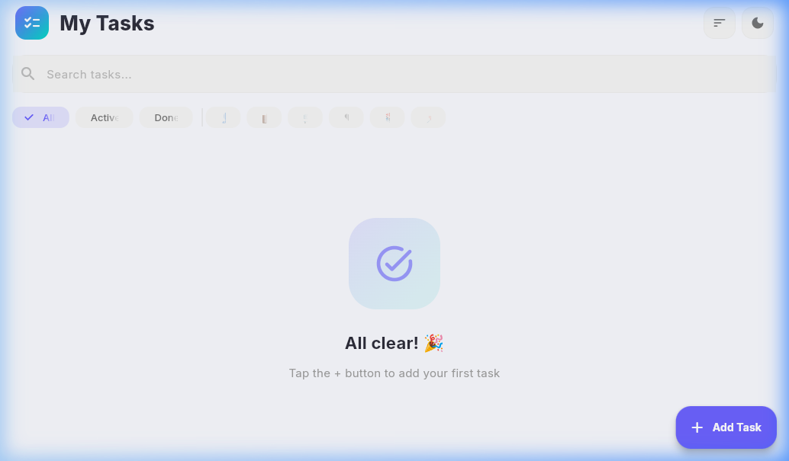
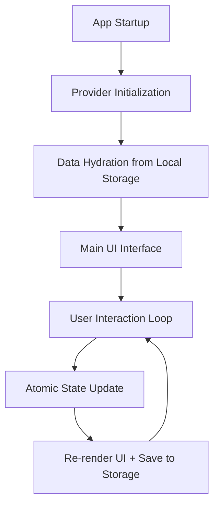
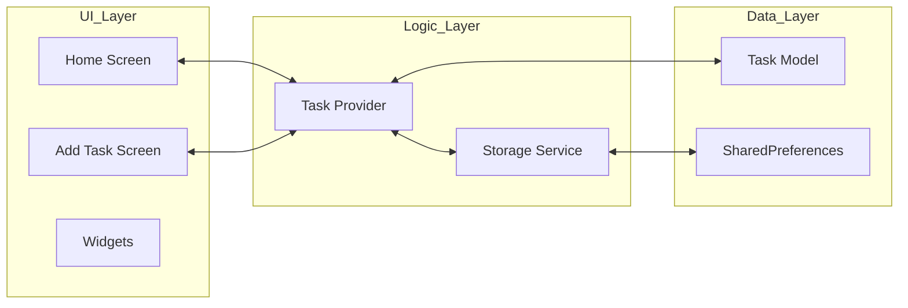

< into a cross-platform mobile experience.

---

<div align="center">
  
</div>

---

## 📋 Table of Contents
- [🎯 Overview](#-overview)
- [🏢 Applications & Use Cases](#-applications--use-cases)
- [🏗️ System Architecture](#-architecture)
- [🔌 Technologies Used](#-technologies-used)
- [⚙️ Installation & Setup](#-installation--setup)
- [🚀 How to Use](#-how-to-use)
- [📁 Project Structure](#-project-structure)
- [📄 License & Author](#-license--author)

---

## 🎯 Overview
**TaskMaster** is a high-performance productivity tool designed to manage daily workflows with precision. Key capabilities include:
- **Comprehensive CRUD operations**: Creating, reading, updating, and deleting tasks with real-time UI synchronization.
- **Advanced State Management**: Powered by the `Provider` pattern for predictable data flow.
- **Reliable Persistence**: Seamless data hydration from local storage using `SharedPreferences`.
- **Intelligent Organization**: Support for 6 distinct task categories and 3 priority levels.
- **Global Search Capability**: Real-time filtering across titles and descriptions.
- **Adaptive Visual Experience**: Fully integrated Light and Dark modes with persistent user preferences.

---

## 🏢 Applications & Use Cases

### 1. Personal Workflow Management
- Tracking daily errands and personal goals.
- Managing health routines and shopping lists.

### 2. Professional Task Tracking
- Categorizing work assignments and deadlines.
- Educational course tracking and resource management.

### 3. Integrated Daily Planning
- Prioritizing urgent vs. non-urgent tasks using high/medium/low status.
- Tracking progress with an integrated percentage-based visualization.

---

## 🏗️ System Architecture

### Macro-Level Logic Flow


### Component Architecture


---

## 🔌 Technologies Used

### Core Frameworks
- **Flutter 3.x**: Cross-platform UI development.
- **Dart 3.x**: Underlying high-performance language.

### Specialized Libraries
- `provider`: Decentralized state management.
- `shared_preferences`: Low-latency local key-value storage.
- `flutter_slidable`: Gestural interaction for list items.
- `google_fonts`: Typographic consistency.
- `uuid`: Generating unique identifiers for data integrity.
- `intl`: Date and time formatting.

---

## ⚙️ Installation & Setup

### Prerequisites
- [Flutter SDK](https://flutter.dev/docs/get-started/install) (latest stable version)
- Dart SDK (included with Flutter)
- A physical or emulated mobile device, or a modern web browser.

### Step 1: Clone the Repository
```bash
git clone https://github.com/EngYahia25/Simple_to-do_Lisy.git
cd Simple_to-do_Lisy/flutter_todo
```

### Step 2: Resolve Dependencies
```bash
flutter pub get
```

### Step 3: Launch the Application
```bash
# Execute on connected device or emulator
flutter run

# Specifically for web testing
flutter run -d chrome
```

---

## 🚀 How to Use

### Managing Tasks
1.  **Creation**: Click the `+ Add Task` Floating Action Button (FAB) and fulfill the task details.
2.  **Completion**: Tap the task card or the checkbox to toggle completion status.
3.  **Modification**: Swipe a task card to the **left** to reveal the edit action.
4.  **Deletion**: Swipe a task card to the **left** and select the delete icon.

### Navigation and Filtering
- Use the **Search Bar** to find specific tasks by content.
- Tap the **Filter Chips** (All / Active / Done) to isolate task subsets.
- Use the **Category Chips** (Emojis) to filter by specific work domains.
- Configure sorting through the **Sort Menu** available in the top header.

---

## 📁 Project Structure
```text
📦 Simple_to-do_Lisy
 ┣ 📂 flutter_todo
 ┃ ┣ 📂 lib
 ┃ ┃ ┣ 📂 models           # Task data schemas
 ┃ ┃ ┣ 📂 providers        # Provider-based state logic
 ┃ ┃ ┣ 📂 screens          # App viewport screens
 ┃ ┃ ┣ 📂 services         # Persistence & local storage
 ┃ ┃ ┣ 📂 theme            # Global design system
 ┃ ┃ ┗ 📂 widgets          # Modular UI components
 ┃ ┣ 📂 screenshots        # Project visualization assets
 ┃ ┗ 📜 pubspec.yaml       # Dependency manifest
 ┣ 📜 App.py               # Original Python logic
 ┗ 📜 LICENSE              # MIT License
```

---

## 📄 License & Author
This project is licensed under the **MIT License**.

Designed and maintained by **[EngYahia25](https://github.com/EngYahia25)**.

---

<div align="center">
  <h3>🌟 Acknowledgments</h3>
  <p>Inspired by modern productivity tools and minimalist design principles.</p>
</div>
]]>
