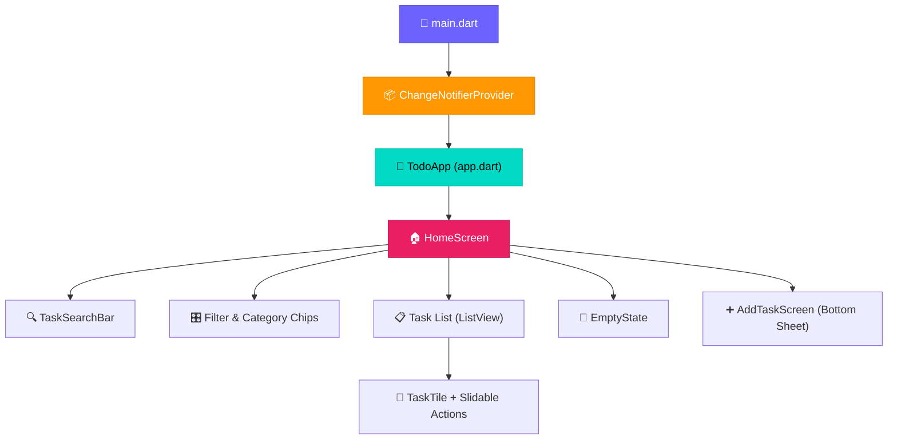
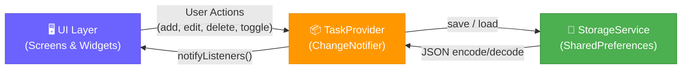
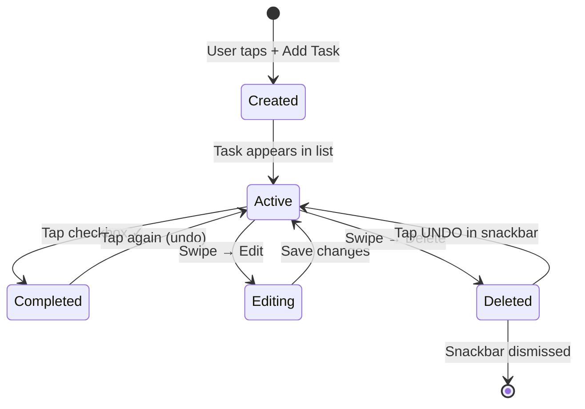

<


**A modern, beautifully designed task management app built with Flutter.**  
Evolved from a simple [Python CLI to-do list](App.py) into a full-featured cross-platform experience.

---


*Home screen with gradient header, filter chips, and modern empty state*

</div>

---

## ✨ Features at a Glance

| Feature | Description |
|:--------|:------------|
| ✏️ **Full CRUD** | Add, edit, toggle complete, and delete tasks |
| 🏷️ **6 Categories** | Personal · Work · Shopping · Health · Education · Other |
| 🔴🟡🟢 **Priority Levels** | High / Medium / Low with intuitive color coding |
| 🔍 **Real-Time Search** | Instant search through titles and descriptions |
| 🎛️ **Smart Filters** | Filter by status (All / Active / Done) and category |
| ↕️ **Sorting Options** | Sort by date or priority (ascending / descending) |
| 🌗 **Dark & Light Theme** | One-tap toggle with persistent preference |
| 👆 **Swipe Actions** | Slide left to reveal Edit and Delete actions |
| ↩️ **Undo Delete** | Snackbar with UNDO after deleting a task |
| 💾 **Local Persistence** | All tasks saved locally via SharedPreferences |
| 📊 **Progress Tracker** | Visual progress bar showing completion percentage |
| ✨ **Smooth Animations** | Animated checkboxes, transitions, and FAB entrance |

---

## 🏗️ Architecture Overview



---

## 🔄 Data Flow



---

## 🗺️ Task Lifecycle



---

## 📂 Project Structure

```
Simple_to-do_Lisy/
│
├── App.py                              # 🐍 Original Python CLI app
├── LICENSE                             # 📄 MIT License
├── README.md                           # 📖 This file
├── screenshots/                        # 🖼️ App screenshots
│   └── app_home.png
│
└── flutter_todo/                       # 📱 Flutter project
    ├── lib/
    │   ├── main.dart                   #    Entry point + Provider setup
    │   ├── app.dart                    #    MaterialApp with theme switching
    │   │
    │   ├── models/
    │   │   └── task.dart               #    Task model + JSON serialization
    │   │
    │   ├── providers/
    │   │   └── task_provider.dart      #    State management (CRUD, filter, sort)
    │   │
    │   ├── services/
    │   │   └── storage_service.dart    #    SharedPreferences persistence layer
    │   │
    │   ├── screens/
    │   │   ├── home_screen.dart        #    Main screen (list, search, filters)
    │   │   └── add_task_screen.dart    #    Add / Edit task bottom sheet
    │   │
    │   ├── widgets/
    │   │   ├── task_tile.dart          #    Task card with slidable actions
    │   │   ├── empty_state.dart        #    Empty list illustration
    │   │   └── search_bar.dart         #    Search input widget
    │   │
    │   └── theme/
    │       └── app_theme.dart          #    Material 3 light & dark themes
    │
    ├── test/
    │   └── widget_test.dart            #    Widget test
    │
    └── pubspec.yaml                    #    Dependencies & metadata
```

---

## ⚙️ Prerequisites

| Tool | Version | Link |
|:-----|:--------|:-----|
| Flutter SDK | ≥ 3.x | [Install Flutter](https://flutter.dev/docs/get-started/install) |
| Dart SDK | ≥ 3.x | Bundled with Flutter |
| IDE | Any | Android Studio / VS Code / IntelliJ |
| Device | — | Android (API 21+), iOS, Chrome, or Desktop |

---

## 🚀 Quick Start

### 1️⃣ Clone the repository

```bash
git clone https://github.com/EngYahia25/Simple_to-do_Lisy.git
cd Simple_to-do_Lisy/flutter_todo
```

### 2️⃣ Install dependencies

```bash
flutter pub get
```

### 3️⃣ Run the app

```bash
# Android / iOS (emulator or device)
flutter run

# Web (Chrome)
flutter run -d chrome

# Windows Desktop
flutter run -d windows
```

### 4️⃣ Build release APK *(optional)*

```bash
flutter build apk --release
# Output: build/app/outputs/flutter-apk/app-release.apk
```

---

## 📖 Usage Guide

| Action | How To |
|:-------|:-------|
| **➕ Add a task** | Tap `+ Add Task` → fill title, description, category, priority → tap **Add Task** |
| **✅ Complete a task** | Tap anywhere on the task card or its checkbox |
| **✏️ Edit a task** | Swipe the task card **← left** → tap the blue **Edit** button |
| **🗑️ Delete a task** | Swipe the task card **← left** → tap the red **Delete** button |
| **↩️ Undo delete** | Tap **UNDO** in the snackbar (4 seconds window) |
| **🔍 Search** | Type in the search bar — filters in real-time |
| **🎛️ Filter by status** | Tap **All** · **Active** · **Done** chips |
| **🏷️ Filter by category** | Tap a category emoji chip: 👤 💼 🛒 ❤️ 📚 📌 |
| **↕️ Sort tasks** | Tap the **sort icon** (≡) in the top-right header |
| **🌙 Toggle theme** | Tap the **moon ☾ / sun ☀** icon in the top-right header |

---

## 🛠️ Tech Stack

| Layer | Technology |
|:------|:-----------|
| **Framework** | [Flutter](https://flutter.dev/) 3.x |
| **Language** | [Dart](https://dart.dev/) 3.x |
| **State Management** | [Provider](https://pub.dev/packages/provider) (ChangeNotifier) |
| **Persistence** | [SharedPreferences](https://pub.dev/packages/shared_preferences) |
| **Design System** | Material 3 (Material You) |
| **Typography** | [Google Fonts](https://pub.dev/packages/google_fonts) — Inter |
| **Slide Actions** | [flutter_slidable](https://pub.dev/packages/flutter_slidable) |
| **IDs** | [uuid](https://pub.dev/packages/uuid) |
| **Date Formatting** | [intl](https://pub.dev/packages/intl) |

---

## 🐍 Original Python Version

This project started as a simple Python CLI to-do list:

```bash
python App.py
```

```
1. Add an item
2. Mark as done (remove item)
3. View to-do items
4. Exit
Enter your choice:
```

The Flutter version elevates this concept into a production-grade mobile app with a modern UI, persistent storage, and rich task management features.

---

## 🤝 Contributing

Contributions are welcome! Feel free to:

1. **Fork** the repository
2. **Create** a feature branch (`git checkout -b feature/amazing-feature`)
3. **Commit** your changes (`git commit -m 'Add amazing feature'`)
4. **Push** to the branch (`git push origin feature/amazing-feature`)
5. **Open** a Pull Request

---

## 📄 License

This project is licensed under the **MIT License** — see the [LICENSE](LICENSE) file for details.

---

<div align="center">

### ⭐ Star this repo if you found it useful!

Made with ❤️ by [EngYahia25](https://github.com/EngYahia25)

</div>
]]>
